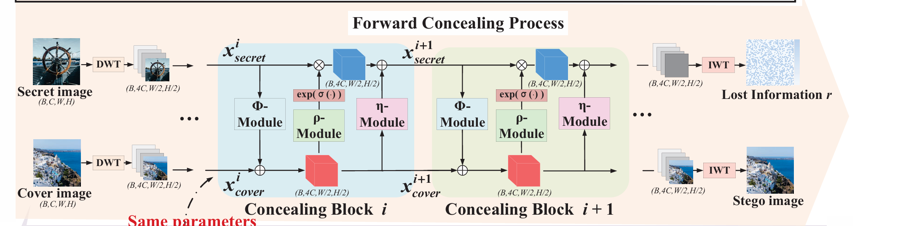
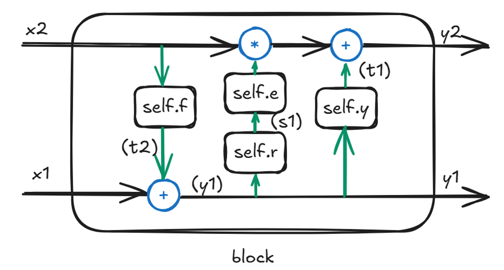
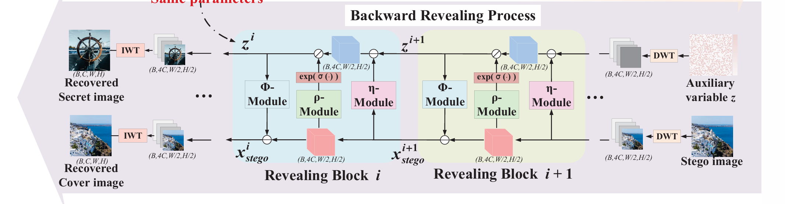
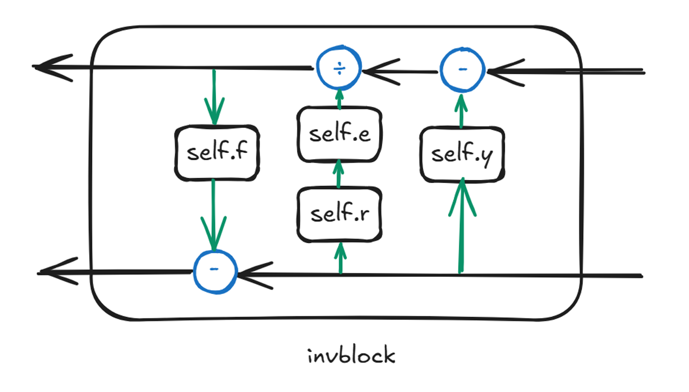
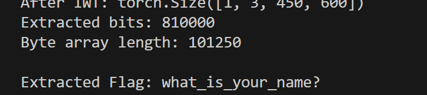

# README

encrypt目录下的main.py展示了隐写的过程：

通过一次离散小波变换（DWT）将每个通道分解为 4 个子带，总共 3×4=12 条子带通道；同时，将要嵌入的文本转化为与封面图像相同尺寸的张量，同样经过 DWT 也得到 12 条子带通道；接着将这两部分子带通道在通道维度上拼接成 24 通道的输入送入网络，网络输出前 12 通道即为融合了秘密信息的子带表示；最后对这 12 通道应用逆小波变换（IWT），重建出 3 通道的隐写图像并保存为 `steg.png`。

本题解题方法参考两篇论文：

[ICCV 2021 Open Access Repository](https://openaccess.thecvf.com/content/ICCV2021/html/Jing_HiNet_Deep_Image_Hiding_by_Invertible_Network_ICCV_2021_paper.html?ref=https://githubhelp.com)

[[1901.03892\] SteganoGAN: High Capacity Image Steganography with GANs](https://arxiv.org/abs/1901.03892)

它的加密过程就是论文给的缩小版

它采用小波变换（DWT)将图像分为低频和高频小波子带，然后再进入可逆块，这样网络可以更好地将秘密信息融合到覆盖图像中

block.py下能看到该神经网络的框架

```
    def forward(self, x):
        x1, x2 = (x.narrow(1, 0, self.channels*4),
                  x.narrow(1, self.channels*4, self.channels*4))

        t2 = self.f(x2)
        y1 = x1 + t2
        s1, t1 = self.r(y1), self.y(y1)
        y2 = self.e(s1) * x2 + t1

        return torch.cat((y1, y2), 1)
```




蓝色部分：基础张量运算(均存在数学逆运算)

绿色箭头：输入输出变换(方向固定，不可逆)

黑色箭头：可逆运算路径。

参考论文给出的Bakcward Revealing Process



在我们这个任务是：

reblock.py

```
    def inverse(self, y):
        # 将输入分成两个相等部分
        y1, y2 = (y.narrow(1, 0, self.split_channels),
                  y.narrow(1, self.split_channels, self.split_channels))
        
        s1 = self.r(y1)
        t1 = self.y(y1)
        e_s1 = self.e(s1)
        x2 = (y2 - t1) / e_s1
        t2 = self.f(x2)
        x1 = y1 - t2
        return torch.cat((x1, x2), 1)
```

renet.py

```
    
    def inverse(self, x):
        # 逆序执行逆变换
        x = self.inv8.inverse(x)
        x = self.inv7.inverse(x)
        x = self.inv6.inverse(x)
        x = self.inv5.inverse(x)
        x = self.inv4.inverse(x)
        x = self.inv3.inverse(x)
        x = self.inv2.inverse(x)
        x = self.inv1.inverse(x)
        return x
```

DWT，IWT本身就是互为逆运算，所以它们互换位置就可以逆向。由此我们可以写出完整的解密脚本(见decrypt目录)恢复flag

